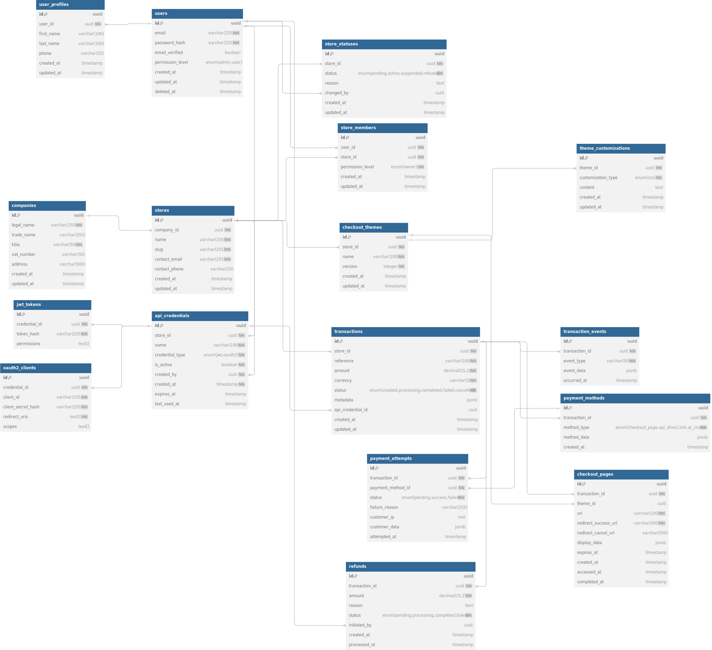

# 🗄️ Database Schema - Ripste

> **Version:** 1.0  
> **Created:** June 2025  
> **Status:** In Development

---

## 📋 Table of Contents

- [Overview](#overview)
- [Functional Domains](#functional-domains)
  - [🔐 Authentication & Authorization](#authentication--authorization)
  - [🏪 Store Management](#-store-management)
  - [🔑 API Authentication](#api-authentication)
  - [🎨 Customization](#customization)
  - [💳 Transactions & Payments](#transactions--payments)
  - [⚖️ GDPR Compliance](#gdpr-compliance)
- [Main Relationships](#main-relationships)

---

## Overview

This database schema has been designed to support the **Ripste** payment platform, offering a simplified and customizable solution for merchants. The architecture follows a DDD (Domain-Driven Design) approach with clear separation of business domains.

### Design Principles

- **🔒 Security by design**: Sensitive data encryption, soft delete for GDPR
- **🚀 Scalability**: Modular structure allowing new features addition
- **📊 Traceability**: Event sourcing for transactions and complete audit trail
- **🌐 Multi-tenant**: Native support for multiple stores per company

---

## Functional Domains

## Authentication & Authorization

### `users`
Main platform users table.

| Column | Type | Constraints | Description |
|---------|------|-------------|-------------|
| `id` | `uuid` | **PK**, `gen_random_uuid()` | Unique identifier |
| `email` | `varchar(255)` | **UNIQUE**, **NOT NULL** | Email address |
| `password_hash` | `varchar(255)` | **NOT NULL** | Password hash |
| `email_verified` | `boolean` | Default: `false` | Email verification status |
| `permission_level` | `enum` | `'admin', 'user'` | Permission level |
| `created_at` | `timestamp` | Default: `now()` | Creation date |
| `updated_at` | `timestamp` | | Last modification date |
| `deleted_at` | `timestamp` | | Soft delete for GDPR |

**Index:** `email`

### `user_profiles`
User profiles with personal information.

| Column | Type | Constraints | Description |
|---------|------|-------------|-------------|
| `id` | `uuid` | **PK**, `gen_random_uuid()` | Unique identifier |
| `user_id` | `uuid` | **FK** → `users.id`, **UNIQUE** | User reference |
| `first_name` | `varchar(100)` | | First name |
| `last_name` | `varchar(100)` | | Last name |
| `phone` | `varchar(20)` | | Phone number |
| `created_at` | `timestamp` | Default: `now()` | Creation date |
| `updated_at` | `timestamp` | | Last modification date |

**Index:** `user_id`

---

## Store Management

### `companies`
Company legal information.

| Column | Type | Constraints | Description |
|---------|------|-------------|-------------|
| `id` | `uuid` | **PK**, `gen_random_uuid()` | Unique identifier |
| `legal_name` | `varchar(255)` | **NOT NULL** | Legal business name |
| `trade_name` | `varchar(255)` | | Trade name |
| `kbis` | `varchar(50)` | **UNIQUE**, **NOT NULL** | KBIS number |
| `vat_number` | `varchar(50)` | | VAT number |
| `address` | `varchar(500)` | | Complete address |
| `created_at` | `timestamp` | Default: `now()` | Creation date |
| `updated_at` | `timestamp` | | Last modification date |

**Index:** `kbis`

### `stores`
Online stores (separated from legal information).

| Column | Type | Constraints | Description |
|---------|------|-------------|-------------|
| `id` | `uuid` | **PK**, `gen_random_uuid()` | Unique identifier |
| `company_id` | `uuid` | **FK** → `companies.id`, **NOT NULL** | Company reference |
| `name` | `varchar(255)` | **NOT NULL** | Store name |
| `slug` | `varchar(255)` | **UNIQUE**, **NOT NULL** | URL slug |
| `contact_email` | `varchar(255)` | **NOT NULL** | Contact email |
| `contact_phone` | `varchar(20)` | | Contact phone |
| `created_at` | `timestamp` | Default: `now()` | Creation date |
| `updated_at` | `timestamp` | | Last modification date |

**Index:** `company_id`, `slug`

### `store_statuses`
Store approval workflow.

| Column | Type | Constraints | Description |
|---------|------|-------------|-------------|
| `id` | `uuid` | **PK**, `gen_random_uuid()` | Unique identifier |
| `store_id` | `uuid` | **FK** → `stores.id`, **NOT NULL** | Store reference |
| `status` | `enum` | `'pending', 'active', 'suspended', 'refused'` | Current status |
| `reason` | `text` | | Change reason |
| `changed_by` | `uuid` | **FK** → `users.id` | User making the change |
| `created_at` | `timestamp` | Default: `now()` | Change date |
| `updated_at` | `timestamp` | | Last modification date |

**Index:** `store_id`, `status`, `created_at`

### `store_members`
User-store relationship with permissions.

| Column | Type | Constraints | Description |
|---------|------|-------------|-------------|
| `id` | `uuid` | **PK**, `gen_random_uuid()` | Unique identifier |
| `user_id` | `uuid` | **FK** → `users.id`, **NOT NULL** | User reference |
| `store_id` | `uuid` | **FK** → `stores.id`, **NOT NULL** | Store reference |
| `permission_level` | `enum` | `'owner'` | Permission level |
| `created_at` | `timestamp` | Default: `now()` | Creation date |
| `updated_at` | `timestamp` | | Last modification date |

**Index:** `user_id`, `store_id`, `(user_id, store_id)` **UNIQUE**

---

## API Authentication

### `api_credentials`
API credentials for stores.

| Column | Type | Constraints | Description |
|---------|------|-------------|-------------|
| `id` | `uuid` | **PK**, `gen_random_uuid()` | Unique identifier |
| `store_id` | `uuid` | **FK** → `stores.id`, **NOT NULL** | Store reference |
| `name` | `varchar(100)` | **NOT NULL** | Credential name |
| `credential_type` | `enum` | `'jwt', 'oauth2'` | Authentication type |
| `is_active` | `boolean` | Default: `true` | Active status |
| `created_by` | `uuid` | **FK** → `users.id`, **NOT NULL** | Creator |
| `created_at` | `timestamp` | Default: `now()` | Creation date |
| `expires_at` | `timestamp` | | Expiration date |
| `last_used_at` | `timestamp` | | Last usage |

**Index:** `store_id`, `credential_type`, `is_active`

### `jwt_tokens`
JWT tokens for API authentication.

| Column | Type | Constraints | Description |
|---------|------|-------------|-------------|
| `id` | `uuid` | **PK**, `gen_random_uuid()` | Unique identifier |
| `credential_id` | `uuid` | **FK** → `api_credentials.id`, **UNIQUE** | Credential reference |
| `token_hash` | `varchar(255)` | **UNIQUE**, **NOT NULL** | Token hash |
| `permissions` | `text[]` | | Feature flags and permissions |

**Index:** `token_hash`

### `oauth2_clients`
OAuth2 clients for authentication.

| Column | Type | Constraints | Description |
|---------|------|-------------|-------------|
| `id` | `uuid` | **PK**, `gen_random_uuid()` | Unique identifier |
| `credential_id` | `uuid` | **FK** → `api_credentials.id`, **UNIQUE** | Credential reference |
| `client_id` | `varchar(255)` | **UNIQUE**, **NOT NULL** | OAuth2 client ID |
| `client_secret_hash` | `varchar(255)` | **NOT NULL** | Client secret hash |
| `redirect_uris` | `text[]` | **NOT NULL** | Redirect URIs |
| `scopes` | `text[]` | | OAuth2 scopes |

**Index:** `client_id`

---

## Customization

### `checkout_themes`
Checkout page customization themes.

| Column | Type | Constraints | Description |
|---------|------|-------------|-------------|
| `id` | `uuid` | **PK**, `gen_random_uuid()` | Unique identifier |
| `store_id` | `uuid` | **FK** → `stores.id`, **NOT NULL** | Store reference |
| `name` | `varchar(100)` | **NOT NULL** | Theme name |
| `version` | `integer` | Default: `1` | Theme version |
| `created_at` | `timestamp` | Default: `now()` | Creation date |
| `updated_at` | `timestamp` | | Last modification date |

**Index:** `store_id`, `(store_id, name, version)` **UNIQUE**

### `theme_customizations`
CSS theme customizations.

| Column | Type | Constraints | Description |
|---------|------|-------------|-------------|
| `id` | `uuid` | **PK**, `gen_random_uuid()` | Unique identifier |
| `theme_id` | `uuid` | **FK** → `checkout_themes.id`, **NOT NULL** | Theme reference |
| `customization_type` | `enum` | `'css'` | Customization type |
| `content` | `text` | | Customization content |
| `created_at` | `timestamp` | Default: `now()` | Creation date |
| `updated_at` | `timestamp` | | Last modification date |

**Index:** `theme_id`, `customization_type`

---

## Transactions & Payments

### `transactions`
Core business: payment transactions.

| Column | Type | Constraints | Description |
|---------|------|-------------|-------------|
| `id` | `uuid` | **PK**, `gen_random_uuid()` | Unique identifier |
| `store_id` | `uuid` | **FK** → `stores.id`, **NOT NULL** | Store reference |
| `reference` | `varchar(100)` | **UNIQUE**, **NOT NULL** | Transaction reference |
| `amount` | `decimal(15,2)` | **NOT NULL** | Amount |
| `currency` | `varchar(3)` | Default: `'EUR'` | Currency |
| `status` | `enum` | `'created', 'processing', 'completed', 'failed', 'cancelled'` | Status |
| `metadata` | `jsonb` | | Merchant business data |
| `api_credential_id` | `uuid` | **FK** → `api_credentials.id` | Creator credential |
| `created_at` | `timestamp` | Default: `now()` | Creation date |
| `updated_at` | `timestamp` | | Last modification date |

**Index:** `store_id`, `reference`, `status`, `created_at`

### `transaction_events`
Event sourcing for transactions.

| Column | Type | Constraints | Description |
|---------|------|-------------|-------------|
| `id` | `uuid` | **PK**, `gen_random_uuid()` | Unique identifier |
| `transaction_id` | `uuid` | **FK** → `transactions.id`, **NOT NULL** | Transaction reference |
| `event_type` | `varchar(50)` | **NOT NULL** | Event type |
| `event_data` | `jsonb` | | Event data |
| `occurred_at` | `timestamp` | Default: `now()` | Occurrence date |

**Index:** `transaction_id`, `event_type`, `occurred_at`

### `payment_methods`
Payment methods (extensible architecture).

| Column | Type | Constraints | Description |
|---------|------|-------------|-------------|
| `id` | `uuid` | **PK**, `gen_random_uuid()` | Unique identifier |
| `transaction_id` | `uuid` | **FK** → `transactions.id`, **NOT NULL** | Transaction reference |
| `method_type` | `enum` | `'checkout_page', 'api_direct', 'link', 'qr_code'` | Method type |
| `method_data` | `jsonb` | | Method-specific data |
| `created_at` | `timestamp` | Default: `now()` | Creation date |

**Index:** `transaction_id`, `method_type`

### `checkout_pages`
Customized checkout pages.

| Column | Type | Constraints | Description |
|---------|------|-------------|-------------|
| `id` | `uuid` | **PK**, `gen_random_uuid()` | Unique identifier |
| `transaction_id` | `uuid` | **FK** → `transactions.id`, **NOT NULL** | Transaction reference |
| `theme_id` | `uuid` | **FK** → `checkout_themes.id` | Applied theme |
| `uri` | `varchar(100)` | **UNIQUE**, **NOT NULL** | Secure URI token |
| `redirect_success_url` | `varchar(500)` | **NOT NULL** | Success URL |
| `redirect_cancel_url` | `varchar(500)` | | Cancel URL |
| `display_data` | `jsonb` | | Display data |
| `expires_at` | `timestamp` | | Expiration date |
| `created_at` | `timestamp` | Default: `now()` | Creation date |
| `accessed_at` | `timestamp` | | First access |
| `completed_at` | `timestamp` | | Completion date |

**Index:** `transaction_id`, `uri`, `expires_at`

### `payment_attempts`
Payment attempts with traceability.

| Column | Type | Constraints | Description |
|---------|------|-------------|-------------|
| `id` | `uuid` | **PK**, `gen_random_uuid()` | Unique identifier |
| `transaction_id` | `uuid` | **FK** → `transactions.id`, **NOT NULL** | Transaction reference |
| `payment_method_id` | `uuid` | **FK** → `payment_methods.id`, **NOT NULL** | Used method |
| `status` | `enum` | `'pending', 'success', 'failed'` | Attempt status |
| `failure_reason` | `varchar(255)` | | Failure reason |
| `customer_ip` | `inet` | | Customer IP |
| `customer_data` | `jsonb` | | Encrypted customer data |
| `attempted_at` | `timestamp` | Default: `now()` | Attempt date |

**Index:** `transaction_id`, `payment_method_id`, `attempted_at`

### `refunds`
Refund management.

| Column | Type | Constraints | Description |
|---------|------|-------------|-------------|
| `id` | `uuid` | **PK**, `gen_random_uuid()` | Unique identifier |
| `transaction_id` | `uuid` | **FK** → `transactions.id`, **NOT NULL** | Transaction reference |
| `amount` | `decimal(15,2)` | **NOT NULL** | Refunded amount |
| `reason` | `text` | | Refund reason |
| `status` | `enum` | `'pending', 'processing', 'completed', 'failed'` | Status |
| `initiated_by` | `uuid` | **FK** → `users.id` | Initiating user |
| `created_at` | `timestamp` | Default: `now()` | Creation date |
| `processed_at` | `timestamp` | | Processing date |

**Index:** `transaction_id`, `status`

---

---

## GDPR Compliance

The schema natively integrates GDPR requirements:

- **🗑️ Soft delete**: `deleted_at` field in `users` table
- **🔐 Encryption**: Sensitive data in `customer_data` (encrypted jsonb)
- **📋 Audit trail**: Complete traceability via `transaction_events`
- **⏰ Retention**: Expiration date management (`expires_at`)

---

## Main Relationships

---